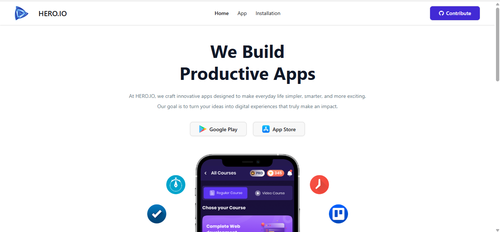

## 📌 Overview
Hero App is a simple web application to display hero information with a clean and responsive UI.

## 🔗 Live Link
https://myhero-apps.netlify.app/

## 🖼 Screenshot

## 🛠 Technologies Used
- React
- JavaScript
- CSS

## ✨ Features
- Hero listing
- Responsive layout
- Simple and user-friendly UI

## 📦 Dependencies
- react
- react-router
- daisyui

## ⚙️ How to Run Locally
1. Clone the repository
git clone https://github.com/archichowdhury4/hero-app.git
